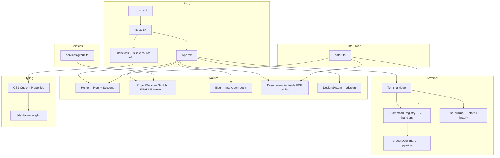

<p align="center">
  
</p>

<h1 align="center">pranjalkumar.com</h1>

<p align="center">
  <strong>Personal portfolio — built from scratch.</strong><br/>
  React 19 · TypeScript · Vite · Zero UI Libraries · Terminal-First
</p>

<p align="center">
  <a href="https://pranjalkumar.com"></a>
  <a href="https://pranjalkumar.com/design"></a>
  
  
  
</p>

---

## What is this?

A personal portfolio website that doubles as a systems-engineering project. Not a template. Not a theme. Every pixel, every component, every interaction built from raw HTML, CSS, and TypeScript.

The site serves two modes of interaction:

1. **Standard Web** — Scroll-based portfolio with project cards, experience timeline, skills, about, and contact sections. Dark/light themed. Fully responsive.
2. **Terminal Mode** — A full-screen CLI overlay with 23 commands, tab completion, command history, SPA navigation, and simulated network tools. Keyboard-driven. Persistent across sessions.

> **This repository is the public-facing documentation of the project.** The source code is private. What you'll find here is the *how* and *why* — architecture deep-dives, the design token system, the animation library, security hardening decisions, and the full blog post documenting the build process.

---

## Architecture



### Module boundaries

| Layer | Responsibility | Key files |
|---|---|---|
| **Entry** | HTML shell, React mount, single CSS import | `index.html`, `index.tsx`, `index.css` |
| **Router** | Hash-based SPA routing, lazy-loaded routes | `App.tsx` |
| **Sections** | Homepage content blocks | `components/sections/*.tsx` |
| **Terminal** | CLI overlay, command pipeline, I/O rendering | `components/terminal/*` |
| **Data** | All content — profile, projects, experience, skills, certs | `data/*.ts` |
| **Services** | External API calls (GitHub REST API) | `services/github.ts` |
| **Hooks** | Shared behavior — theming, scroll reveal | `hooks/*.ts` |
| **Animations** | Framer Motion variant library (25+ presets) | `animations/*.ts` |
| **Config** | Feature flags, metadata, site constants | `config/*.ts` |

### Lazy loading strategy

Every route except the homepage is lazy-loaded with `React.lazy()` + `Suspense`:

```typescript
const ProjectDetail = lazy(() =>
  import('./components/features/projects/ProjectDetail')
    .then((m) => ({ default: m.ProjectDetail }))
);
const Blog = lazy(() =>
  import('./components/features/Blog')
    .then((m) => ({ default: m.Blog }))
);
```

The `@react-pdf/renderer` package (~400KB) is additionally split into a separate chunk via Vite's `manualChunks` and only loaded when the user clicks "Download PDF."

---

## Technical Deep-Dives

| Document | What it covers |
|---|---|
| [**Architecture Overview**](architecture/overview.md) | Module boundaries, data flow, routing, build pipeline, code splitting |
| [**Terminal Emulator**](architecture/terminal-emulator.md) | Command pipeline, `ProcessResult` type system, tab completion, `NAVIGATE:${string}` pattern |
| [**Design Tokens**](architecture/design-tokens.md) | CSS custom property system, `data-theme` cascading, the "three CSS files" bug, WCAG contrast audit |
| [**Animation System**](architecture/animation-system.md) | 25+ Framer Motion variants, easing curve philosophy, IntersectionObserver scroll-reveal |
| [**Resume Engine**](architecture/resume-engine.md) | Client-side PDF generation, lazy-loading, single-source-of-truth data pattern |
| [**Security Hardening**](architecture/security-hardening.md) | CSP headers, README XSS vulnerability, DOMPurify, API timeouts, header audit |
| [**Adaptive Navigation**](#adaptive-navigation-system) | CSS Container Queries, interactive drawer, focus trapping, horizontal scroll snapping |


---

## The Design System

The site's visual language is built on **CSS Custom Properties** (design tokens). No Tailwind. No Sass. No CSS-in-JS. Standard CSS with custom properties, native nesting, `color-mix()`, and `clamp()`.

The full design system is live at [`/design`](https://pranjalkumar.com/design) and documented here:

- [**Design System Spec**](design-system/SPEC.md) — Color palette, typography, spacing, radii, motion, contrast audit
- [**tokens.css**](design-system/tokens.css) — The actual token file (CSS custom properties)
- [**design-system.css**](design-system/design-system.css) — Styles for the design system documentation page

### Color palette

| Token | Dark | Light | Role |
|---|---|---|---|
| `--mint` | `#a8d8c8` | `#1f7a5e` | Primary accent, links, terminal prompt |
| `--lavender` | `#c4b5e8` | `#5a44a8` | Section labels, display emphasis, logo dot |
| `--peach` | `#f4b8a4` | `#b3553a` | Tags, badges, error states |
| `--sky` | `#9ec8e8` | `#2a6a98` | Info states, skill badges |
| `--bg` | `#111113` | `#faf7f0` | Page background |
| `--text` | `#f0eee8` | `#18161e` | Primary text |

### Typography

| Family | Usage | Weight |
|---|---|---|
| Cormorant Garamond | Display headings (hero, section titles) | 400 |
| Plus Jakarta Sans | Body text, UI labels | 400 / 500 / 600 |
| JetBrains Mono | Code, terminal, metadata, tags | 400 |

---

## The Terminal

Not a styled `<textarea>`. A structured command interpreter with:

- **23 commands** — `help`, `about`, `projects`, `skills`, `whoami`, `scan`, `ping`, `ls`, `cat`, `neofetch`, `sudo`, `design`, and more
- **Tab completion** with argument-context awareness (e.g., `projects --details <Tab>` cycles through project IDs)
- **Command history** persisted to `localStorage`, navigable with arrow keys
- **SPA navigation** via the `NAVIGATE:${string}` template literal type
- **Async command support** with loading indicators for API calls
- **Man pages** for every command via `help <cmd>` or `man <cmd>`

Full technical breakdown: [**Terminal Emulator Deep-Dive**](architecture/terminal-emulator.md)

---

## Security

This is a static site. There's still plenty to secure.

- **Content Security Policy** — `script-src 'self'` (no `unsafe-inline`). Served via `vercel.json` headers and Vite dev middleware.
- **XSS mitigation** — Removed `rehype-raw` from the Markdown renderer. DOMPurify wraps every `dangerouslySetInnerHTML`.
- **API hardening** — `AbortController` with 5-second timeouts on all external fetches.
- **Security headers** — `X-Frame-Options: DENY`, `X-Content-Type-Options: nosniff`, `Referrer-Policy: strict-origin-when-cross-origin`, `Permissions-Policy` disabling camera/mic/geo.
- **Link safety** — All `target="_blank"` links use `rel="noopener noreferrer"`.

Full technical breakdown: [**Security Hardening Deep-Dive**](architecture/security-hardening.md)

---

## Adaptive Navigation System

The site uses a "content-aware" responsive strategy rather than rigid device-based breakpoints.

- **CSS Container Queries** — The navbar uses `@container navbar (max-width: ...)` to monitor its available layout space, enabling it to adapt correctly in split-screen windows or vertical monitors.
- **Interactive Drawer** — A custom-built mobile menu using `framer-motion` for smooth, spring-animated transitions.
- **Production-Grade A11y** — Implements a strict **Focus Trap** (keeping keyboard focus within the drawer), **Focus Return** (returning focus to the toggle on close), and **Body Scroll Locking**.
- **Scroll Snapping** — Dense navigation sections (like the 10 `/design` links) use horizontal scroll snapping to group items neatly on tablets.

---

## Stack

| Layer | Technology | Version |
|---|---|---|
| Framework | React | 19.2 |
| Language | TypeScript | 5.8 |
| Bundler | Vite | 6.2 |
| Animation | Framer Motion | 12.24 |
| PDF Engine | @react-pdf/renderer | 4.5 |
| Markdown | react-markdown + remark-gfm | 10.1 |
| Sanitization | DOMPurify | 3.4 |
| Icons | Lucide React | 0.562 |
| Deployment | Cloudflare Pages | — |

**What's not in the stack:** No CSS-in-JS. No Tailwind. No Sass. No component library (Radix, Shadcn, etc.). No state management library. No backend. No database.

---

## Project structure

```
index.html                  — Entry point, meta tags, CSP, theme flash prevention
index.css                   — Single authoritative stylesheet (38KB, all tokens + components)
index.tsx                   — React mount
App.tsx                     — BrowserRouter, lazy routes, terminal state
types.ts                    — Shared TypeScript interfaces

config/
  sections.ts               — Feature flags for homepage sections
  metadata.ts               — Site metadata constants
  site.ts                   — Site-wide configuration

data/
  profile.ts                — Name, bio, role, location, availability, email
  projects.ts               — Project cards + detail page data
  experience.ts             — Work history cards
  skills.ts                 — Capability groups and tags
  certs.ts                  — Certifications
  socials.ts                — Social links
  posts.ts                  — Blog post registry
  ctf.ts                    — CTF writeup data

components/
  layout/
    Navbar.tsx              — Navigation, theme toggle, terminal button
    Footer.tsx              — Copyright
  sections/
    Hero.tsx                — Landing section with animated tagline
    Projects.tsx            — Project card grid
    Experience.tsx          — Work history cards
    Skills.tsx              — Capability groups with count animation
    About.tsx               — About blurb + brand lockup
    Contact.tsx             — Contact link rows
  features/
    Blog.tsx                — Blog listing page
    BlogPost.tsx            — Individual blog post renderer
    Resume.tsx              — Resume page (web view)
    ResumePDF.tsx           — PDF document definition (@react-pdf/renderer)
    DesignSystem.tsx         — Design system documentation (50KB, 10 sections)
    NotFound.tsx            — 404 page
    projects/
      ProjectDetail.tsx     — Full project page (GitHub README renderer)
  terminal/
    TerminalMode.tsx        — Full-screen CLI overlay
    TerminalBoot.tsx        — Boot sequence animation
    TerminalInput.tsx       — Input line, cursor, ghost suggestions
    TerminalOutput.tsx      — Scrollable output buffer
    TerminalLine.tsx        — Line renderer (maps types to colors)
    useTerminal.ts          — Terminal state hook (history, submission pipeline)
    commands/
      index.ts              — Command registry + processCommand pipeline
      help.ts, about.ts, projects.ts, skills.ts, contact.ts,
      whoami.ts, scan.ts, ping.ts, ls.ts, cat.ts, sudo.ts,
      neofetch.ts, uname.ts, echo.ts, date.ts, history.ts,
      cert.ts, ctf.ts, internship.ts, open.ts, design.ts, clear.ts
    types/
      terminal.types.ts     — TerminalLine, ProcessResult, Command interfaces
  ui/
    ProofStrip.tsx          — Credential pills below hero
    CustomCursor.tsx        — Custom cursor effect

hooks/
  useTheme.ts               — Dark/light/system theme with localStorage persistence
  useReveal.ts              — IntersectionObserver scroll-reveal

services/
  github.ts                 — fetchProjectReadme, fetchProjectMeta

animations/
  index.ts                  — Re-exports
  micro.ts                  — 25+ Framer Motion variant presets
  utils.ts                  — Easing curves (EASE_EDITORIAL, EASE_SNAPPY)
  hover.ts                  — Hover interaction variants
  page.ts                   — Page transition variants
  section.ts                — Section entrance variants

public/
  favicon.svg               — Branded favicon
  logo-mark.svg             — Primary brand mark (calligraphic P with lavender dot)
  robots.txt                — Crawl directives
  sitemap.xml               — Sitemap
  vercel.json               — Production security headers + CSP
```

---

## Blog

The full technical blog post documenting the build process is available at:
👉 [**How I built this site from scratch**](https://pranjalkumar.com/blog/building-this-site)

---

## Brand Identity

The brand mark is a calligraphic **P** with a base serif, cap serif, and a lavender accent dot. It exists in two variants:

- **Primary mark** (`logo-mark.svg`) — 78×93, used in the About section lockup
- **Favicon** (`favicon.svg`) — 32×32, dark rounded-square with simplified P glyph

Both adapt to dark/light themes via CSS custom properties: `--logo-glyph`, `--logo-dot`, `--logo-divider`.

---

## Contact

**Pranjal Kumar**
- Email: [contact@pranjalkumar.com](mailto:contact@pranjalkumar.com)
- GitHub: [@euphoric-habromaniac](https://github.com/euphoric-habromaniac)
- LinkedIn: [pranjalkumar1024](https://linkedin.com/in/pranjalkumar1024)

---

<p align="center">
  <em>1st year CSE student. Backend engineer. Security researcher.<br/>I build systems and find the holes in them.</em>
</p>
