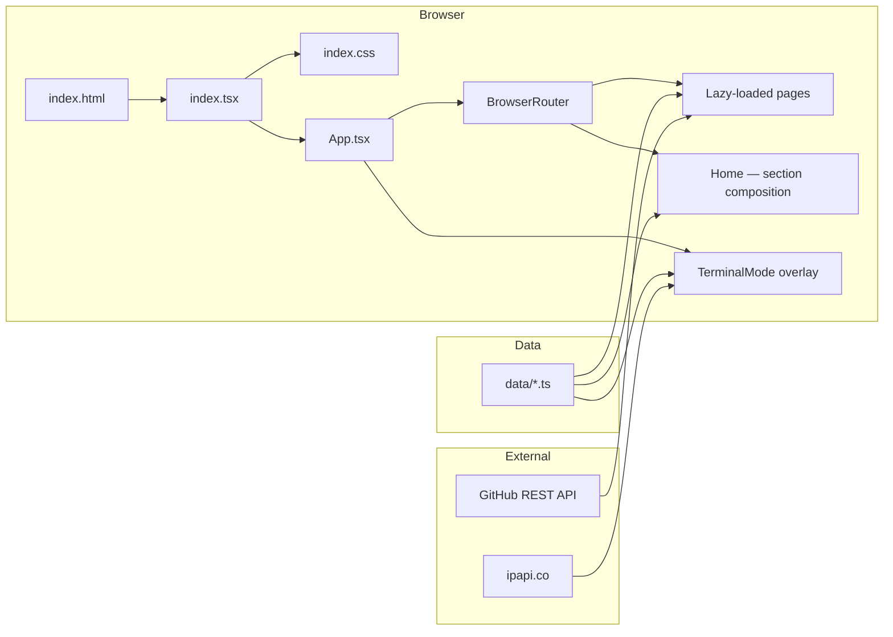

# Architecture Overview

> System architecture, module boundaries, data flow, and build pipeline for the portfolio site.

---

## High-level architecture

The site is a **single-page application** built with React 19, TypeScript, and Vite. There's no backend, no database, no server-side rendering. Everything runs in the browser.



### Core principles

1. **Single stylesheet.** `index.css` is the only CSS file imported by the application. It contains all design tokens, all component styles, all animations. `tokens.css` and `styles.css` exist as documentation artifacts — they are never imported. This was a hard-won lesson (see [Design Tokens](design-tokens.md) for the full story).

2. **Data-driven content.** All user-facing content lives in `data/`. Profile, projects, experience, skills, certifications, social links — every piece of text the site displays comes from a typed TypeScript file. Components never contain hardcoded content (with one exception: the Contact section's `ROWS` array).

3. **Zero runtime dependencies for styling.** No Tailwind, no Sass, no CSS-in-JS. Styling is done with CSS custom properties (design tokens), native CSS nesting, `clamp()`, and `color-mix()`. The argument for preprocessors has essentially vanished.

4. **Terminal as first-class citizen.** The terminal overlay isn't a novelty feature — it's a complete navigation system with its own state management, command pipeline, and I/O rendering. It can do everything the web view can do, plus more (network tools, man pages, filesystem simulation).

---

## Module map

```
├── Entry layer
│   ├── index.html          — HTML shell, meta tags, theme flash prevention script
│   ├── index.tsx           — React.createRoot, imports index.css
│   └── index.css           — Single source of truth (38KB)
│
├── Application layer
│   ├── App.tsx             — BrowserRouter, lazy routes, terminal state
│   └── types.ts            — Shared TypeScript interfaces
│
├── Component layer
│   ├── layout/             — Navbar, Footer
│   ├── sections/           — Hero, Projects, Experience, Skills, About, Contact
│   ├── features/           — Blog, Resume, DesignSystem, NotFound, ProjectDetail
│   ├── terminal/           — TerminalMode, Input, Output, Line, commands/, types/
│   └── ui/                 — ProofStrip, CustomCursor
│
├── Data layer
│   ├── data/               — Content (profile, projects, experience, skills, certs, socials, posts, ctf)
│   └── config/             — Feature flags, metadata, site constants
│
├── Service layer
│   └── services/github.ts  — GitHub REST API (README fetch, repo metadata)
│
├── Hook layer
│   ├── hooks/useTheme.ts   — Dark/light/system with localStorage persistence
│   └── hooks/useReveal.ts  — IntersectionObserver scroll-reveal
│
├── Animation layer
│   └── animations/         — Framer Motion variants (25+ presets), easing curves
│
└── Static layer
    └── public/             — favicon.svg, logo-mark.svg, robots.txt, sitemap.xml, vercel.json
```

---

## Routing

The app uses `BrowserRouter` from React Router 6.28. All routes are defined in `App.tsx`:

| Path | Component | Loading |
|---|---|---|
| `/` | `Home` | Eager |
| `/project/:id` | `ProjectDetail` | Lazy |
| `/resume` | `Resume` | Lazy |
| `/blog` | `Blog` | Lazy |
| `/blog/:slug` | `BlogPost` | Lazy |
| `/design` | `DesignSystem` | Lazy |
| `*` | `NotFound` | Lazy |

The homepage is the only eagerly-loaded route. Every other route is wrapped in `React.lazy()` + `Suspense` with a minimal loading indicator (a terminal-style `~$ loading...` prompt).

### Navigation modes

Navigation can happen through three mechanisms:

1. **Standard links** — React Router `<Link>` components and `<a>` tags
2. **Terminal commands** — `design`, `cat resume.pdf`, `projects --details <id>` all trigger SPA navigation via the `NAVIGATE:${string}` return type
3. **Navbar adaptation** — The navbar renders different link sets depending on the current route (home sections vs. back-arrow for sub-pages vs. 10 anchor links for the design system)

---

## Code splitting

Vite's `rollupOptions.manualChunks` splits the vendor bundle:

```typescript
manualChunks: {
  'react-vendor': ['react', 'react-dom', 'react-router-dom'],
  'framer-motion': ['framer-motion'],
}
```

The `@react-pdf/renderer` package (~400KB) is never imported at the top level. It's dynamically imported only when the user clicks "Download PDF":

```typescript
const [{ pdf }, { ResumePDFDoc }] = await Promise.all([
  import('@react-pdf/renderer'),
  import('./ResumePDF'),
]);
```

This keeps the initial bundle lean. The PDF engine loads in ~1-2 seconds on demand.

---

## Theming

Theme state is managed by the `useTheme` hook and persisted to `localStorage` under the key `pk-theme`. The hook supports three modes: `dark`, `light`, and `system` (follows OS preference via `prefers-color-scheme`).

The theme toggle sets a `data-theme` attribute on the `<html>` element. All colors are CSS custom properties that cascade from this attribute:

```css
:root, :root[data-theme="dark"] {
  --bg: #111113;
  --text: #f0eee8;
  --mint: #a8d8c8;
}

:root[data-theme="light"] {
  --bg: #faf7f0;
  --text: #18161e;
  --mint: #1f7a5e;
}
```

A flash-prevention script in `index.html` reads `localStorage` before React mounts and sets the correct `data-theme` attribute synchronously, preventing the white-flash-on-dark-theme problem.

---

## Build pipeline

| Step | Tool | Purpose |
|---|---|---|
| Dev server | Vite 6.2 | HMR, security headers middleware |
| TypeScript | tsc 5.8 | Type checking (strict mode) |
| Linting | ESLint 9 + security plugin | Code quality + security patterns |
| Compression | vite-plugin-compression | Pre-compressed production assets |
| Production | `vite build` | Tree-shaking, code splitting, minification |
| Deployment | Cloudflare Pages | CDN, automatic HTTPS |

### Security headers in dev

Vite's dev server injects security headers via a custom plugin so CSP violations are caught during development, not after deployment:

```typescript
{
  name: 'security-headers',
  configureServer(server) {
    server.middlewares.use((_req, res, next) => {
      res.setHeader('Content-Security-Policy', "default-src 'self'; ...");
      res.setHeader('X-Frame-Options', 'DENY');
      res.setHeader('X-Content-Type-Options', 'nosniff');
      next();
    });
  },
}
```

---

## Data flow

```mermaid
flowchart TD
    DATA[data/*.ts] -->|import| SECTIONS[Section components]
    DATA -->|import| TERMINAL[Terminal commands]
    DATA -->|import| RESUME[Resume + ResumePDF]
    
    SECTIONS -->|render| DOM[DOM]
    TERMINAL -->|render| TERM_DOM[Terminal output]
    RESUME -->|render| WEB_VIEW[Web resume]
    RESUME -->|@react-pdf| PDF[PDF blob → download]
    
    GH[GitHub API] -->|fetch| PROJECT_DETAIL[ProjectDetail]
    IPAPI[ipapi.co] -->|fetch| WHOAMI[whoami command]
    
    PROJECT_DETAIL -->|react-markdown| README_DOM[Rendered README]
```

Content flows in one direction: from `data/*.ts` files into components. There's no state management library. React's built-in `useState` handles all local state. The only "global" state is the theme (via `useTheme` hook, which reads/writes `localStorage`).

External API calls are limited to two services:
- **GitHub REST API** — Fetches README.md and repository metadata for the project detail page
- **ipapi.co** — Fetches visitor IP/geolocation for the `whoami` terminal command

Both use `AbortController` with timeouts. Neither stores credentials. Rate limits are handled gracefully (GitHub's unauthenticated limit is 60 req/hour; the site caches responses in `sessionStorage`).
